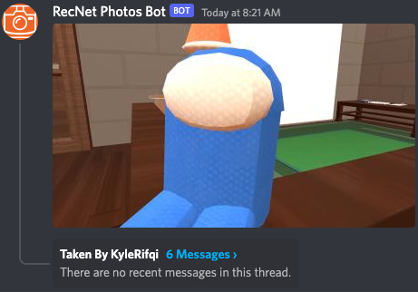
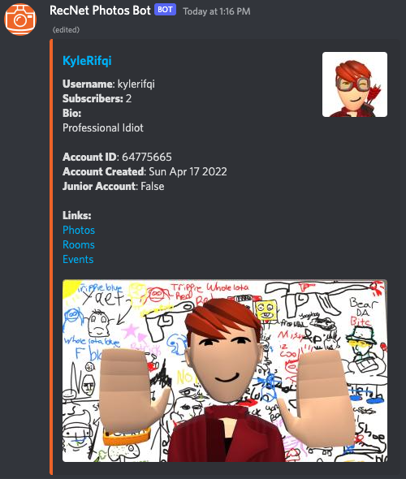

# RecNet Photos Bot
I got tired of having to download the photos from RecNet and reuploading them on discord to show my friends, so instead of doing a task that would take a few minutes, i made the sane decision to take a few days to do that task automatically for me.


RecNet Photos Bot is a discord bot that utilizes the RecNet API to periodically send new photos taken by users into a discord channel.

## 🌅 Features
You can subscribe to a user using `rr!subscribe <username>`, and when a subscribed user uploads new photo(s) to RecNet, the bot will send them to a designated channel that can be set with `rr!channel <#channel>`.


When a new photo is taken, the bot will send a photo into the channel with a thread for people to discuss the image.



Unrelated to photos, but the bot can also show information of a users profile.



## 🛠 Requirements
1. Node.js 16.15+
2. Discord Bot Token

## 🔌 Installation
Add your bot token to `src/config.json`, you can also change the prefix if you like (Bot icon provided in media as `icon.png`). Then, use either NPM or Yarn to install all dependencies in the project and build the project. For this example I will be using Yarn.
```bash
# Install all dependancies
yarn install

# Build the project using typescript (Do this after adding the token)
yarn build

# Run the project
yarn start
```

## 🤝 Contributing
Im relatively new to github so im not really sure how to do things here, but pull requests are welcome and please open an issue if there are any bugs you find.

You can also contact me on discord at `kr#2917`.

## 📜 License
[MIT](https://choosealicense.com/licenses/mit/)